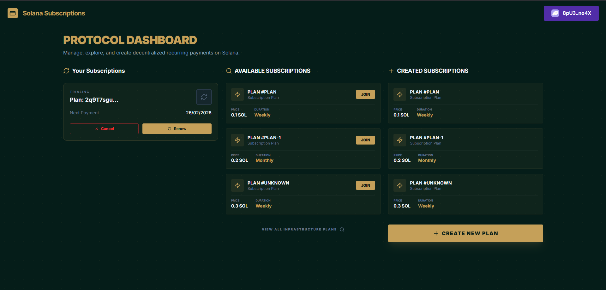
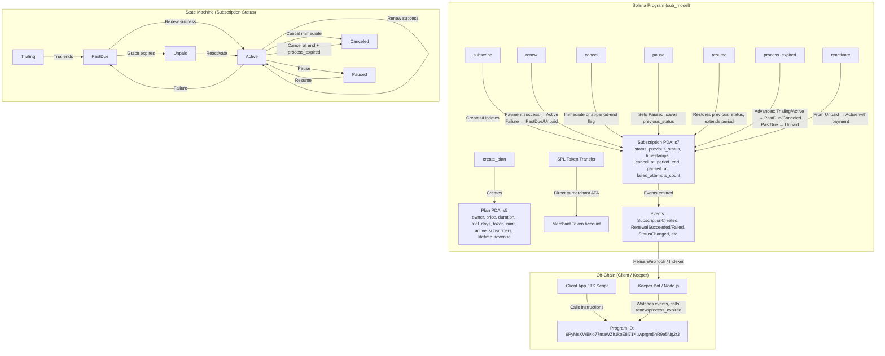

# Sub-model-solana – On-Chain Subscription Billing Program

A trustless Solana program for subscription billing, built for the Superteam Earn bounty. Handles plans, subscriptions, trials, renewals (with failures/retries), pauses/resumes (time freeze), grace periods, cancel-at-period-end, reactivation, and merchant stats.

Repo: https://github.com/0xfave/sub-model-solana  
Devnet Deployment: https://solscan.io/account/6PyMsXWBKo77maWZir1kpE8i71Kuwprgm5hR9e5Ng2r3?cluster=devnet  

> For the full story, trade-offs, and bounty context, read the article:  
[Rebuilding Subscription Billing as a Trustless Solana Program](https://0xfave.hashnode.dev/bringing-subscription-billing-on-chain-a-solana-experiment)

> Check [website](https://sub-model-solana-ecsuy2off-fave28s-projects.vercel.app/)



## Quick Start

1. Clone & build:
   ```bash
   git clone https://github.com/0xfave/sub-model-solana
   cd sub-model-solana
   anchor build
   ```

2. Test:
   ```bash
   anchor test
   ```

3. Deploy (devnet):
   ```bash
   anchor deploy --provider.cluster devnet
   ```

## Features

- Multi-merchant plans with unique IDs & versions
- Subscriptions with trials, payments in SPL tokens (USDC-like)
- User-signed renewals with failure persistence (PastDue → Unpaid after 3 retries)
- Pause/resume with period freeze (restores previous status)
- Permissionless `process_expired` for state transitions (e.g., trial end → PastDue, grace expire → Unpaid)
- Reactivation from Unpaid
- Merchant analytics: active_subscribers & lifetime_revenue
- Events for off-chain indexing (Helius webhooks)

## Architecture Diagram



## Web2 vs Solana Comparison

| Aspect                  | Web2 (e.g. Stripe)                          | Solana On-Chain (this program)                          | Trade-offs / Notes                                      |
|-------------------------|---------------------------------------------|----------------------------------------------------------|---------------------------------------------------------|
| Billing trigger         | Server cron                                 | Permissionless `renew` + keeper / bot                    | No central server, but requires off-chain automation    |
| Payment custody         | Platform holds funds                        | Direct to merchant ATA                                   | Trustless, no withdrawal step                           |
| Retry logic             | Automatic dunning                           | Manual retry (up to 3), state persists                   | Needs off-chain notification                            |
| Grace period            | Server-side access control                  | On-chain `has_access()` + grace deadline                 | Fully auditable                                         |
| Cancellation            | Immediate or end-of-period                  | Immediate or `cancel_at_period_end` + `process_expired`  | Requires keeper call for end-of-period transition       |
| Pause                   | Admin/user toggle                           | User/merchant, freezes period duration                   | Fair to users                                           |
| Data transparency       | Opaque                                      | All state on-chain, events for indexing                  | Public auditability                                     |
| Cost per renewal        | ~0–2.9% + fixed                             | ~0.000005 SOL + token transfer fee                       | Extremely cheap                                         |
| Automation reliability  | 99.99%                                      | Depends on keepers/bots                                  | Can use Switchboard or custom Node.js bot               |

## Usage Examples
### 1. Fetch All Plans & User's Subscriptions

This is the core `fetchData` logic from your component — very useful for dashboards.

```ts
import { Program } from "@coral-xyz/anchor";
import { PublicKey } from "@solana/web3.js";

// Assuming you have:
// const program = getProgram(provider);
// const wallet = useWallet();

async function fetchPlansAndSubs() {
  try {
    // Fetch all plans
    const allPlans = await program.account.plan.all();
    const plans = allPlans.map((p) => ({
      publicKey: p.publicKey,
      planId: p.account.planId || "unknown",
      price: p.account.price?.toNumber() || 0,
      durationSeconds: p.account.durationSeconds?.toNumber() || 0,
      trialDays: p.account.trialDays?.toNumber() || 0,
      tokenMint: p.account.tokenMint ? new PublicKey(p.account.tokenMint) : null,
      owner: new PublicKey(p.account.owner),
      description: "Subscription Plan",
    }));

    // Fetch user's subscriptions
    const allSubs = await program.account.subscription.all();
    const userSubs = allSubs
      .filter((s) => wallet.publicKey && s.account.user.equals(wallet.publicKey))
      .map((s) => ({
        publicKey: s.publicKey,
        plan: new PublicKey(s.account.plan),
        status: getStatusNumber(s.account.status), // your helper to convert enum/object to number
        currentPeriodEnd: s.account.currentPeriodEnd?.toNumber() || 0,
        cancelAtPeriodEnd: s.account.cancelAtPeriodEnd,
      }));

    return { plans, userSubscriptions: userSubs };
  } catch (err) {
    console.error("Fetch error:", err);
    return { plans: [], userSubscriptions: [] };
  }
}

// Helper for status (from your code)
function getStatusNumber(statusVal: any): number {
  if (typeof statusVal === "number") return statusVal;
  if (typeof statusVal === "object") {
    const keys = Object.keys(statusVal);
    if (keys.length > 0) {
      const map = { Trialing: 0, Active: 1, PastDue: 3, Unpaid: 4, Canceled: 5, Paused: 6 };
      return map[keys[0]] ?? 0;
    }
  }
  return 0;
}
```

### 2. Subscribe to a Plan (Trial or Paid)

From your `handleSubscribe` — cleaned up and generalized.

```ts
async function subscribeToPlan(plan: { publicKey: PublicKey; tokenMint: PublicKey; price: BN }) {
  if (!wallet.connected || !wallet.publicKey) throw new Error("Wallet not connected");

  const provider = getProvider(); // your AnchorProvider helper
  const program = getProgram(provider);

  const isWsol = plan.tokenMint.equals(new PublicKey("So11111111111111111111111111111111111111112"));

  // Get or create user's ATA
  let userAta = await getAssociatedTokenAddress(plan.tokenMint, wallet.publicKey);
  const userAtaInfo = await connection.getAccountInfo(userAta);
  if (!userAtaInfo) {
    if (isWsol) {
      // Create WSOL ATA + fund it (your getOrCreateWsolAccount logic)
      userAta = await getOrCreateWsolAccount(provider, wallet.publicKey, plan.price.toNumber() + 1e6);
    } else {
      throw new Error("User needs a token account for this mint");
    }
  }

  // Get merchant ATA (assume you have it from plan.owner)
  const merchantAta = await getAssociatedTokenAddress(plan.tokenMint, plan.owner);

  const [subscriptionPda] = PublicKey.findProgramAddressSync(
    [Buffer.from("subscription"), wallet.publicKey.toBuffer(), plan.publicKey.toBuffer()],
    program.programId
  );

  const tx = await program.methods
    .subscribe()
    .accounts({
      user: wallet.publicKey,
      plan: plan.publicKey,
      subscription: subscriptionPda,
      userTokenAccount: userAta,
      merchantTokenAccount: merchantAta,
      tokenProgram: TOKEN_PROGRAM_ID,
      systemProgram: SystemProgram.programId,
    })
    .transaction();

  const signedTx = await wallet.signTransaction(tx);
  const txSig = await connection.sendRawTransaction(signedTx.serialize());
  await connection.confirmTransaction(txSig);

  console.log("Subscribed:", txSig);
  return txSig;
}
```

### 3. Renew a Subscription

From `handleRenew`.

```ts
async function renewSubscription(sub: { publicKey: PublicKey; plan: PublicKey }) {
  if (!wallet.connected || !wallet.publicKey) throw new Error("Wallet not connected");

  const provider = getProvider();
  const program = getProgram(provider);

  // Fetch plan to get tokenMint & price
  const planAcc = await program.account.plan.fetch(sub.plan);
  const tokenMint = planAcc.tokenMint;

  const userAta = await getAssociatedTokenAddress(tokenMint, wallet.publicKey);
  const merchantAta = await getAssociatedTokenAddress(tokenMint, planAcc.owner);

  const tx = await program.methods
    .renew()
    .accounts({
      user: wallet.publicKey,
      plan: sub.plan,
      subscription: sub.publicKey,
      userTokenAccount: userAta,
      merchantTokenAccount: merchantAta,
      tokenProgram: TOKEN_PROGRAM_ID,
      systemProgram: SystemProgram.programId,
    })
    .transaction();

  const signedTx = await wallet.signTransaction(tx);
  const txSig = await connection.sendRawTransaction(signedTx.serialize());
  await connection.confirmTransaction(txSig);

  console.log("Renewed:", txSig);
  return txSig;
}
```

### 4. Cancel a Subscription (Immediate or At Period End)

From `handleCancel`.

```ts
async function cancelSubscription(sub: { publicKey: PublicKey; plan: PublicKey }, immediate: boolean) {
  if (!wallet.connected || !wallet.publicKey) throw new Error("Wallet not connected");

  const provider = getProvider();
  const program = getProgram(provider);

  const tx = await program.methods
    .cancel(immediate)
    .accounts({
      user: wallet.publicKey,
      plan: sub.plan,
      subscription: sub.publicKey,
    })
    .transaction();

  const signedTx = await wallet.signTransaction(tx);
  const txSig = await connection.sendRawTransaction(signedTx.serialize());
  await connection.confirmTransaction(txSig);

  console.log("Cancelled:", txSig);
  return txSig;
}
```

### 5. Create a New Plan (Merchant Side)

From `handleCreatePlan`.

```ts
async function createNewPlan({
  planId,
  version,
  priceSol,
  durationDays,
  trialDays,
}: {
  planId: string;
  version: number;
  priceSol: number;
  durationDays: number;
  trialDays: number;
}) {
  if (!wallet.connected || !wallet.publicKey) throw new Error("Wallet not connected");

  const provider = getProvider();
  const program = getProgram(provider);

  const priceLamports = Math.round(priceSol * 1e9);
  const durationSeconds = durationDays * 24 * 60 * 60;

  const [planPda] = PublicKey.findProgramAddressSync(
    [Buffer.from("plan"), wallet.publicKey.toBuffer(), Buffer.from(planId)],
    program.programId
  );

  const tx = await program.methods
    .createPlan(planId, version, new BN(priceLamports), new BN(durationSeconds), new BN(trialDays), SOL_MINT)
    .accounts({
      owner: wallet.publicKey,
      plan: planPda,
      tokenMintAccount: SOL_MINT,
      systemProgram: SystemProgram.programId,
    })
    .transaction();

  const signedTx = await wallet.signTransaction(tx);
  const txSig = await connection.sendRawTransaction(signedTx.serialize());
  await connection.confirmTransaction(txSig);

  console.log("Plan created:", txSig);
  return txSig;
}
```

### Bonus: Utility – Get or Create WSOL ATA (from your code)

```ts
async function getOrCreateWsolAccount(provider: AnchorProvider, userPubkey: PublicKey, minAmountLamports: number) {
  const wSOLMint = new PublicKey("So11111111111111111111111111111111111111112");
  const wSOLAta = await getAssociatedTokenAddress(wSOLMint, userPubkey);

  const accountInfo = await connection.getAccountInfo(wSOLAta);
  if (accountInfo) return wSOLAta;

  const rent = await connection.getMinimumBalanceForRentExemption(165);
  const lamports = minAmountLamports + rent;

  const tx = new Transaction().add(
    createAssociatedTokenAccountInstruction(userPubkey, wSOLAta, userPubkey, wSOLMint),
    SystemProgram.transfer({ fromPubkey: userPubkey, toPubkey: wSOLAta, lamports })
  );

  tx.feePayer = userPubkey;
  tx.recentBlockhash = (await connection.getLatestBlockhash()).blockhash;

  const signedTx = await provider.wallet.signTransaction(tx);
  const sig = await connection.sendRawTransaction(signedTx.serialize());
  await connection.confirmTransaction(sig);

  return wSOLAta;
}
```

## Testing

LiteSVM tests cover happy paths, edges, time jumps, failures, overflows, and reverts. See `tests/sub_model.test.ts`.

## Security Notes

- PDA isolation
- Checked math
- Token mint/owner constraints
- Re-subscribe guards

## Off-Chain Integration

Use a Node.js keeper with Helius to auto-call `renew` / `process_expired` on events or timers.


## License

MIT